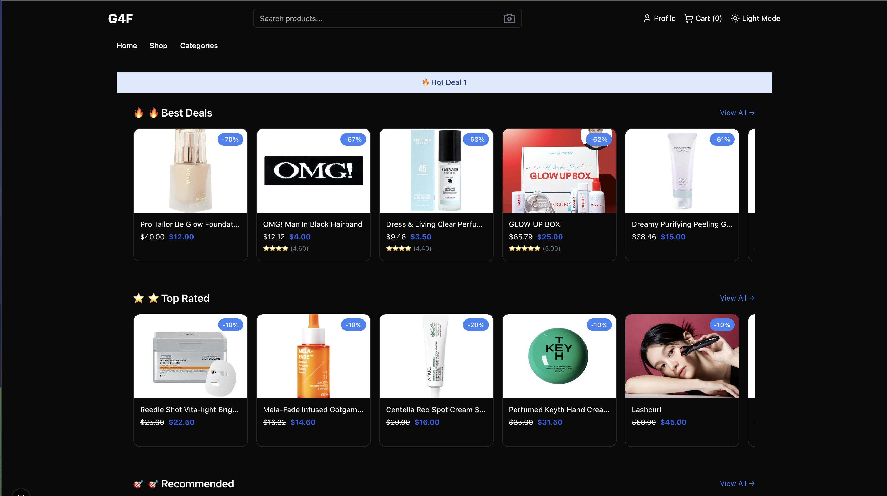
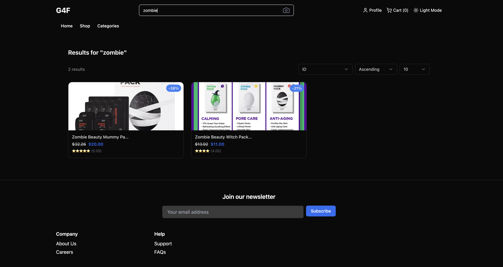
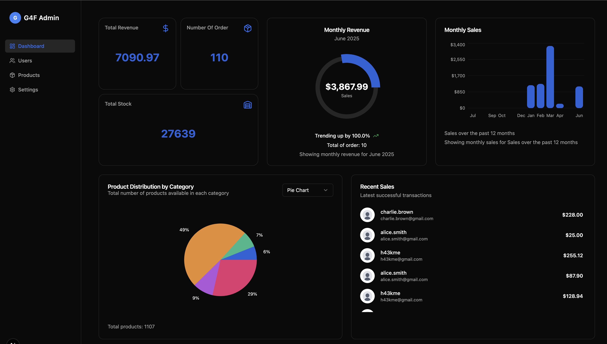
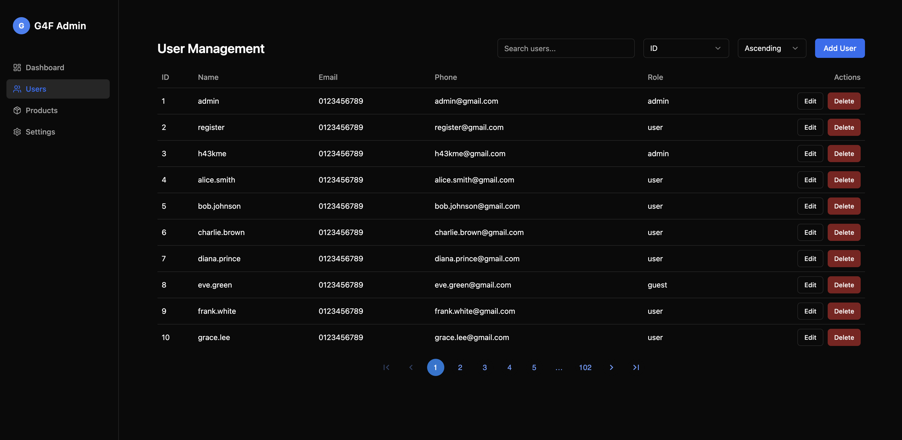

# G4F-shop Frontend (Next.js)

A modern, responsive e-commerce frontend built with **Next.js**, designed to consume the **g4f-shop API** and provide a seamless shopping experience.

## Table of Contents
---

- [Overview](#overview)
- [Features](#features)
- [Tech Stack](#tech-stack)
- [Getting Started](#getting-started)
  - [Prerequisites](#prerequisites)
  - [Installation](#installation)
  - [Environment Variables](#environment-variables)
  - [Running the Frontend](#running-the-frontend)
- [API Integration](#api-integration)
- [Routing & Pages](#routing--pages)
- []
- [Contact](#contact)


## Overview {#overview}
---

The **g4f-shop frontend** is a React-based web application using Next.js framework. It connects to the **g4f-shop API** backend to provide:

- Product browsing and detailed views
- User authentication (login/register/profile)
- Shopping cart and checkout flow
- User profile and order management
- Responsive and accessible UI/UX design

This frontend is optimized for SEO and performance using Next.js features such as SSR, SSG, and API routes.

---

## Features
---

### Shopping Experience
- Home page with product listings
- Category filtering and search
- Product detail with variant selection
- Add to cart, update quantities, checkout flow

### User Accounts
- Email/password login and Google login
- JWT-based authentication with refresh handling
- Profile and avatar management
- Order and payment history

### Admin Panel
- Role-based routing and dashboard
- Admin management for users, products, and settings


## Tech Stack {#tech-stack}
---

- **Next.js 14+**
- **React 18**
- **Tailwind CSS**
- **TypeScript**
- **NextAuth.js** (auth)
- **Zod** (form validation)
- **React Query** or **SWR** (data fetching)
- **Stripe.js** (checkout)
- **Axios**
- **React Hook Form**
- **Shadcn UI** (UI components)


## Getting Started {#getting-started}
---

### Prerequisites {#prerequisites}

- Node.js 18.x or higher
- npm or yarn
- Access to the running g4f-shop API backend (locally or remote)

### Installation {#installation}

Clone the repo and install dependencies:

```bash
git clone https://github.com/yourusername/g4f-shop-frontend.git
cd g4f-shop-frontend
npm install
# or
yarn install
```

### Environment Variables {#environment-variables}

```bash
# Node environment: development, production, or test
NODE_ENV=development

# Base API URL for backend requests
NEXT_PUBLIC_API_URL=http://localhost:3001/api/mx/v1

# Environment name (e.g. development, staging, production)
NEXT_PUBLIC_ENV=development

# Frontend base URL
NEXT_PUBLIC_BASE_URL=http://localhost:3000

# NextAuth.js configuration
NEXTAUTH_URL=http://localhost:3000
NEXTAUTH_SECRET=your_nextauth_secret_here

# Stripe public key for payment integration
NEXT_PUBLIC_STRIPE_PUBLISHABLE_KEY=pk_test_XXXXXXXXXXXXXXXX

# Google OAuth credentials for login
GOOGLE_CLIENT_ID=your_google_client_id_here
GOOGLE_CLIENT_SECRET=your_google_client_secret_here
```

### Running the Frontend {#running-the-frontend}
Start the development server:

```bash
npm run dev
# or
yarn dev
```

The app will be available at `http://localhost:3000`.

To build and start for production:
```bash
npm run build
npm run start
```

## [API](https://github.com/zhangwusan/) Integration {#api-integration} 
---

- All backend requests are made to ${NEXT_PUBLIC_API_BASE_URL}.
- Authentication tokens are stored securely (HttpOnly cookies or localStorage).
- Use API client wrappers with Axios or Fetch for error handling and token refresh.
- Example endpoint: GET /products, POST /auth/login, etc. 

## Routing & Pages {#routing--pages}
---

### Public
- `/` — Home and product listings  
- `/categories` — Filtered product listings by category  
- `/products/[id]` — Product detail with variants  
- `/products/search` — Search products  
- `/auth/login` — Login page  
- `/auth/register` — Register page  

### User Area
- `/auth/profile` — View user information  
- `/auth/profile/settings` — Update profile settings  
- `/auth/profile/payments` — View payment history  
- `/profile` — Edit profile info and avatar  
- `/cart` — View and manage shopping cart  
- `/cart/checkout` — Stripe checkout flow  
- `/settings/orders` — Order history  

### Admin Panel
- `/admin/dashboard` — Admin overview  
- `/admin/users` — User management  
- `/admin/products` — Product management  
- `/admin/settings` — Admin settings  

---

## Authentication Flow
---

- Login via credentials or Google OAuth  
- Session handled by **NextAuth.js**  
- Tokens stored securely in **cookies**  
- Protected routes use **middleware** and **server-side session checks**


## Reference the Image in README.md
---







## Contact {#contact}
---

For questions or support, please contact:

- Developer: `Wusan`
- Email: `zhangwusan1@gmail.com`
- Telegram: `Zhangwusan123_32_1`
